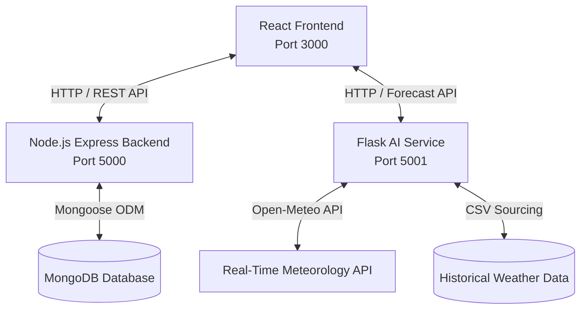

# 🏕️ Smart Camping Management System
An intelligent, multi-role camping management web application integrated with an AI-powered Safety Prediction Engine. The system enables campers to book sites, rent camping equipment, hire professional guides, execute secure checkouts, and assess real-time camping safety forecasts driven by weather models.
---
## 🏗️ System Architecture
The application is structured as a modern **three-tier architecture** with three independent modules working in harmony:

### 1. 💻 React Frontend (`/frontend`)
*   **Core**: React (v19) & React Router Dom (v7)
*   **Styling**: Tailwind CSS for responsive, modern UI design and custom interactive transitions
*   **Icons**: Lucide React
*   **Charts & Visuals**: Recharts (for administrative analytics & ML reports)
*   **Integrations**: Google Pay (`@google-pay/button-react`), React Easy Crop
*   **Invoicing**: PDF generation using `jspdf` & `html2canvas`
### 2. 🔌 Node.js Express Backend (`/backend`)
*   **Core**: Node.js & Express API
*   **Database**: MongoDB & Mongoose ODM
*   **Authentication**: JWT (JSON Web Tokens) with role-based routing middleware
*   **Security**: Password hashing via `bcryptjs`
*   **File Handling**: Multer (for campsite, equipment, and profile pictures)
*   **Notification Engine**: Nodemailer (sending automatic trip bookings, receipt alerts, and equipment stock notifications)
### 3. 🧠 Python Machine Learning Service (`/ai_module`)
*   **Core Framework**: Flask & Flask-CORS
*   **Data Science**: Pandas, NumPy, Scikit-Learn (Supervised Classification)
*   **Serialization**: Joblib (loading Scalers, LabelEncoders, and Trained Models)
*   **Weather Sourcing**: Integrated with Open-Meteo API (for up to 14 days forecast) and fallback historical CSV dataset matching for >14 days.
---
## 🌟 Key Product Features
### 👤 User & Profile Management
*   **Multi-Role Dashboards**: Tailored, high-fidelity dashboards for **Campers**, **Campsite Owners**, **Guides**, and **Admins**.
*   **Access Control**: Route protection based on user authentication state and specific role permissions.
*   **Profile Editing**: Interactive user profiles featuring custom picture uploads.
### 🎪 Campsite Booking
*   **Exploration**: Dynamic listing of campgrounds across Sri Lanka.
*   **Booking Process**: Intuitive form checking campsite availability, total camper count, and pricing calculations.
*   **Owner Control**: Owners can post campsites, edit details, track booking request history, and toggle approval states.
### 🎒 Equipment Rental Store
*   **Virtual Shop**: A full store featuring camping gear filtered by categories (tents, lights, sleeping bags, cooking kits).
*   **Add/Edit Gear**: Owners and Admins can maintain stock, upload equipment imagery, and track rented inventories.
*   **Stock Notifications**: Automatic alert generation when out-of-stock equipment becomes available.
### 🗺️ Professional Guide Hire & Calendar
*   **Browse Guides**: Campers can view profiles, review ratings, bookmark favorites, and request specific guide schedules.
*   **Guide Workspace**: Dedicated guide dashboard tracking total calendar bookings, upcoming trips, visual earnings graphs, and reviewer feedback.
### 💳 Secure Checkout & Payments
*   **Payment Checkout**: Support for online card submissions and bank slips (with image upload auditing).
*   **Google Pay**: Built-in Google Pay checkout buttons.
*   **Invoice Generation**: Beautifully structured receipts available for download in PDF format.
*   **Admin Audit**: Verification dashboard allowing administrators to approve or reject pending bank-transfer payments.
### 🌦️ AI Camping Safety Analysis
*   **Intelligent Forecast Evaluation**: Predicts the safety level of any selected destination on chosen dates.
*   **Real-time Meteorology**: Connects with live weather APIs to analyze:
    *   Mean daily temperature (°C)
    *   Solar/Shortwave radiation sum (MJ/m²)
    *   Precipitation hours (duration of rainfall)
    *   Maximum wind speeds (km/h)
*   **Historical Data Sourcing**: Fallback estimation module utilizing a localized Sri Lankan weather CSV dataset if dates are further than 14 days out.
---
## 🧠 Machine Learning Engine Breakdown
The AI module implements a supervised classification workflow to evaluate if selected camping conditions are safe.
### 1. Data Cleaning & Feature Engineering
*   **Phase 1 Cleaning (`preprocessing_phase1.py`)**: Standardizes timestamp formatting, executes forward-filling (`ffill`) on missing values, drops non-predictive columns (e.g. snowfall, country), and filters out extreme weather anomalies.
*   **Phase 2 Normalization (`preprocessing_phase2.py`)**: 
    *   **Categorical Encoding**: Fits a `LabelEncoder` onto city names, saving the artifact as `city_label_encoder.pkl`.
    *   **Safety Boundary Thresholding**: Dynamically engineers the target classification label (`is_unsafe`) based on safety boundaries:
        $$\text{is\_unsafe} = \begin{cases} 1 & \text{if } \text{rain\_sum} > 5.0\text{ mm} \lor \text{windspeed\_10m\_max} > 25.0\text{ km/h} \\ 0 & \text{otherwise} \end{cases}$$
    *   **Feature Scaling**: Fits a `StandardScaler` to the continuous meteorological features, exporting the scaler as `weather_scaler.pkl` to guarantee identical feature distributions during online prediction.
### 2. Model Training & Evaluation
*   **Model Selection**: Random Forest Classifier evaluated against baseline classifiers, tuning hyperparameters (`n_estimators`, `max_depth`, `min_samples_split`) to resolve overfitting.
*   **Performance Metrics**: Achieves exceptional prediction statistics on test subsets, plotting diagnostic charts:
    *   `00_SUMMARY_DASHBOARD.png` (Grid plot combining ROC, PR, metrics, and feature weights)
    *   `06_confusion_matrix.png` (Confusion Matrix tracking True/False Positives and Negatives)
    *   `07_roc_curve.png` (Receiver Operating Characteristic with AUC score mapping)
    *   `08_precision_recall.png` (Precision-Recall curve highlighting baseline boundaries)
    *   `09_feature_importance.png` (Relative weight scaling of individual weather features)
    *   `10_probability_distribution.png` (Prediction confidence histogram mapping)
---
## ⚙️ Environment Configuration
### Backend Env (`/backend/.env`)
Create a file named `.env` in the `/backend` directory:
```env
PORT=5000
MONGO_URI=mongodb+srv://<username>:<password>@<cluster>.mongodb.net/<dbname>
JWT_SECRET=your_jwt_signing_key_here
FRONTEND_URL=http://localhost:3000
EMAIL_USER=your-email@gmail.com
EMAIL_PASS=your-gmail-app-password
```
### Frontend Env (`/frontend/.env`)
Create a file named `.env` in the `/frontend` directory:
```env
React_Port_URI=http://localhost:3000
REACT_APP_API_URL=http://localhost:5000
```
---
## 🚀 Installation & Running Guide
Ensure you have **Node.js (v18+)**, **MongoDB**, and **Python (v3.9+)** installed.
### Step 1: Run the MongoDB Instance
Make sure your MongoDB server (local or Atlas) is accessible and matches the `MONGO_URI` configured in your backend `.env`.
### Step 2: Initialize & Launch the Express Backend
```bash
cd backend
npm install
npm run dev
```
*The server will boot and listen at `http://localhost:5000`.*
### Step 3: Initialize & Launch the Flask AI Service
1. Navigate to the AI directory:
   ```bash
   cd ai_module
   ```
2. Create and activate a Python virtual environment:
   ```bash
   python -m venv venv
   # On Windows:
   .\venv\Scripts\activate
   # On macOS/Linux:
   source venv/bin/activate
   ```
3. Install dependencies:
   ```bash
   pip install -r requirements.txt
   ```
4. Start the Flask API:
   ```bash
   python scripts/api.py
   ```
*The Flask forecast service will launch on `http://localhost:5001`.*
### Step 4: Initialize & Launch the React Frontend
```bash
cd frontend
npm install
npm start
```
*The browser should automatically open `http://localhost:3000` displaying the landing dashboard.*
---
## 📁 Core Directory Structure
```text
Smart_Camping_Management_System/
├── ai_module/                       # Python ML Prediction Service
│   ├── data/                        # Cleaned & Raw Weather CSV Datasets
│   ├── models/                      # Saved Scalers, Encoders, & Pickle Models
│   ├── scripts/                     # Preprocessing, Training, and Flask API Scripts
│   └── requirements.txt             # Python Package Dependencies
│
├── backend/                         # Express.js Node API Server
│   ├── src/
│   │   ├── config/                  # Database Connections
│   │   ├── controllers/             # Endpoint Controllers (Express handlers)
│   │   ├── middleware/              # JWT Validation & Multer Uplink
│   │   ├── models/                  # Mongoose MongoDB Schemas
│   │   ├── routes/                  # Express REST Endpoint Routers
│   │   ├── services/                # Accessory Services
│   │   └── utils/                   # Mail Senders & Accessory Utilities
│   ├── uploads/                     # Uploaded Campsite/Equipment Images
│   ├── app.js                       # Primary Backend Entrypoint
│   └── package.json
│
├── frontend/                        # React.js SPA Client
│   ├── public/                      # Static Assets & Icons
│   ├── src/
│   │   ├── common/                  # Global Navbar, Footer, & Loaders
│   │   ├── components/              # Multi-role Dashboard & Module Modules
│   │   │   ├── admin/               # Administrative Dashboards
│   │   │   ├── camping-sites-mgt/   # Campsite Listings & Owner Modules
│   │   │   ├── equipment-mgt/       # Rental Store & Booking Panels
│   │   │   ├── feedback-review/     # Star Ratings & Feedback Form Components
│   │   │   ├── guides-mgt/          # Hire Guides & Guide Workspaces
│   │   │   ├── payment-mgt/         # Google Pay & Credit Checkouts
│   │   │   └── safety-analysis/     # AI Safety Predictor Form & Graphs
│   │   ├── context/                 # Auth & Toast State Context Providers
│   │   ├── App.js                   # Application Routing Config
│   │   └── index.js                 # React DOM Renderer
│   ├── package.json
│   └── tailwind.config.js
```
